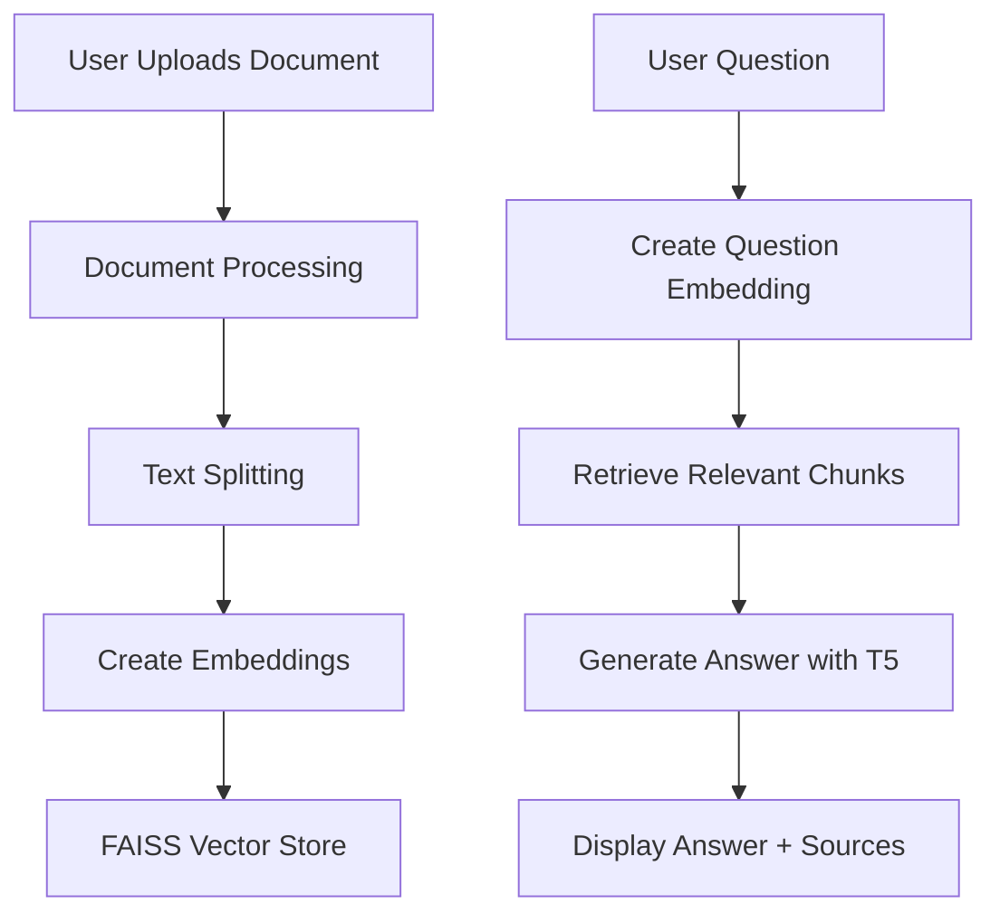

# Document Q&A with T5 and LangChain

A Streamlit-based web application that allows users to upload documents and ask questions about their content using a T5 language model and retrieval-augmented generation (RAG).

## 📋 Table of Contents
- [Overview](#-overview)
- [Features](#-features)
- [Architecture](#-architecture)
- [Installation](#-installation)
- [Usage](#-usage)
- [Code Explanation](#-code-explanation)
- [Dependencies](#-dependencies)
- [Limitations](#-limitations)
- [Future Improvements](#-future-improvements)

## 🌟 Overview

This application implements a Retrieval-Augmented Generation (RAG) system that combines document retrieval with a T5 language model to answer questions about uploaded documents. It's particularly useful for extracting information from large documents without having to read through them entirely.

## ✨ Features

- **Document Upload**: Supports both PDF and text file uploads
- **Interactive Chat Interface**: Natural language question-answering about document content
- **Source Tracking**: Shows which parts of the document were used to generate answers
- **Model Configuration**: Adjust model parameters like temperature and response length
- **Efficient Retrieval**: Uses FAISS for fast similarity search in document embeddings

## 🏗️ Architecture



## 🚀 Installation

1. Clone the repository:
   ```bash
   git clone <repository-url>
   cd <repository-directory>
   ```

2. Create and activate a virtual environment:
   ```bash
   python -m venv venv
   source venv/bin/activate  # On Windows: venv\Scripts\activate
   ```

3. Install dependencies:
   ```bash
   pip install -r requirements.txt
   ```
   
   Additional requirements for this app:
   ```bash
   pip install streamlit PyPDF2 langchain transformers faiss-cpu sentence-transformers
   ```

## 🖥️ Usage

1. Run the Streamlit app:
   ```bash
   streamlit run app_mvp.py
   ```

2. Open the provided URL in your web browser

3. Upload a document (PDF or text)

4. Configure model settings in the sidebar (optional)

5. Ask questions about the document in the chat interface

## 📝 Code Explanation

### Key Components

1. **Model Initialization** (`initialize_model` function)
   - Loads the T5 model and tokenizer
   - Sets up the text generation pipeline with configurable parameters
   - Returns a LangChain-compatible language model interface

2. **Document Processing** (`setup_retrieval_qa` function)
   - Splits documents into manageable chunks
   - Generates embeddings using HuggingFace's sentence transformers
   - Creates a FAISS vector store for efficient similarity search
   - Sets up the retrieval-augmented generation chain

3. **Streamlit UI**
   - Handles file uploads
   - Displays chat interface
   - Shows source documents for answers

### Important Imports

- `streamlit`: Web application framework
- `langchain`: Framework for building LLM applications
- `transformers`: For loading T5 models and tokenizers
- `FAISS`: For efficient similarity search
- `sentence-transformers`: For generating document embeddings

## 📦 Dependencies

- Python 3.8+
- Streamlit
- PyTorch
- Transformers
- LangChain
- FAISS
- Sentence-Transformers
- PyPDF2 (for PDF processing)

## ⚠️ Limitations

- Limited by the context window size of the T5 model
- May struggle with very large documents
- Accuracy depends on the quality of the source documents
- First-time model download can be slow

## 🔮 Future Improvements

- Add support for more document formats (Word, PowerPoint, etc.)
- Implement document summarization
- Add user authentication
- Support for conversation history
- Batch processing of questions
- Export functionality for answers
- Better error handling for edge cases

## 📄 License

This project is licensed under the MIT License - see the [LICENSE](LICENSE) file for details.

## 🙏 Acknowledgements

- [HuggingFace](https://huggingface.co/) for the Transformers library
- [LangChain](https://langchain.com/) for the RAG framework
- [Streamlit](https://streamlit.io/) for the web interface
- [FAISS](https://github.com/facebookresearch/faiss) for efficient similarity search
